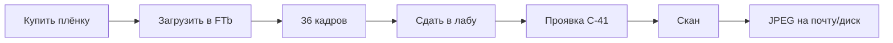

---
tags:
  - фотография
  - плёнка
  - лаборатория
---

# Плёнка, проявка, сканы

## Какие плёнки взять первыми

### Цветная (проявка C-41 — везде)

| Плёнка | Характер | Для вас с жёлтым FL |
|--------|----------|---------------------|
| **Fujifilm C200** | Нейтральные цвета, чуть холоднее | Балансирует тепло объектива |
| **Kodak ColorPlus 200** | Тёплая, зерно, «плёночно» | Усилит винтаж — если нравится |
| **Kodak Ultramax 400** | Универсал, пасмурная погода | +1 ступень света |

Начните с **1× C200 + 1× ColorPlus** — сравните на одних и тех же сюжетах.

### Чёрно-белая (проявка чаще дороже и дольше)

| Плёнка | Комментарий |
|--------|-------------|
| **Ilford HP5 Plus 400** | Прощает ошибки экспозиции |
| **Kodak Tri-X 400** | Классический контрастный ч/б |

С **жёлтым FL** на ч/б жёлтизна **не портит** цвет — хороший способ снять «чисто», если надоест тепло на цвете.

### Не брать пока

- Слайд (E-6) — дороже, узкий диапазон
- Плёнка **просроченная** без опыта
- «Креативные» с предэкспозицией — позже

## Цикл одного рулона

## Оцифровка — три пути

| Способ | Качество | Для новичка |
|--------|----------|-------------|
| **Лаба: проявка + скан** | Хорошее, единообразное | ✅ **Лучший старт** |
| Планетарный сканер дома | Отличное | Дорого, долго |
| Сфотографировать плёнку на цифру | Слабое | ❌ Не советую |

**Ориентир Москва:** 500–800 ₽ за рулон «проявка + скан» (Noritsu/Frontier).

---

## Лаборатории: Краснодар

| Лаба | Адрес | Проявка + скан | Комментарий |
|------|-------|----------------|-------------|
| **Яркий** ⭐ | ул. **Красная, 145** | ~**500 ₽** стандарт / ~900 премиум | C-41, D-76, плёнка в наличии |
| **Фотолиния** | photoline23.ru | ~**750–800 ₽** | Noritsu |
| **Острова** | **Лукьяненко, 109** | ~750–850 ₽ | Плёнка + проявка |

**При сдаче:** «C-41 / D-76, скан стандарт на флешку, **без сильной автокоррекции**».

**3 катушки:** ~1 500 ₽ (Яркий) — ~2 400 ₽ (Фотолиния).

[Яркий Краснодар](https://photo.yarkiy.ru/krasnodar/photos/photograph-development)

### Плёнки под стиль (полумрак)

| Задача | Плёнка |
|--------|--------|
| Ч/б, полумрак | **Ilford HP5 400** |
| Цвет в темноте | **Portra 800**, **Cinestill 800T** |
| День / штатив | **Fomapan 100**, **C200** |
| Тёплый винтаж + FL | ColorPlus 200, Cinestill 800T |

### Что сказать в лаборатории

- «Цветная негативная, **C-41**»
- «Нужен **скан в JPEG**, нейтральный цвет» (или «как есть»)
- Сохраните **коробку** — на ней DX-код; если стёрт — назовите тип плёнки

## Хранение

| Что | Как |
|-----|-----|
| Неснятая плёнка | Холодильник в заводской упаковке — опционально |
| Снятый рулон | В плотной кассете, сдать в лабу **в течение месяцев**, не годами |
| Готовые негативы | В файлах от лабы — архив; можно пересканировать позже |

## Сколько ждать

- Проявка + скан: **1–3 дня** в городе
- Почта в лабу: +2–5 дней

Не сдавайте **первый** рулон в последний день перед отпуском — оставьте время на ошибки.

---

← [[02 - Экспозиция]] · Далее → [[04 - Первые 36 кадров]]
