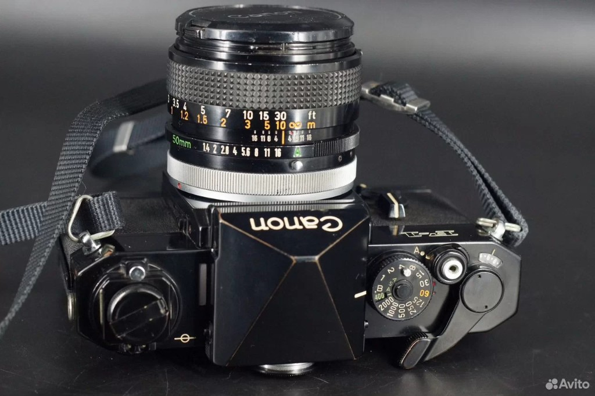
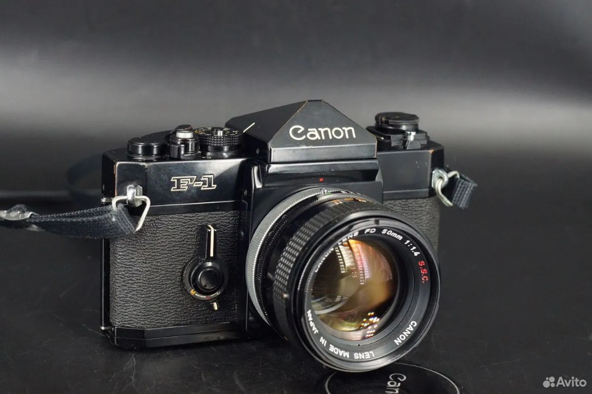
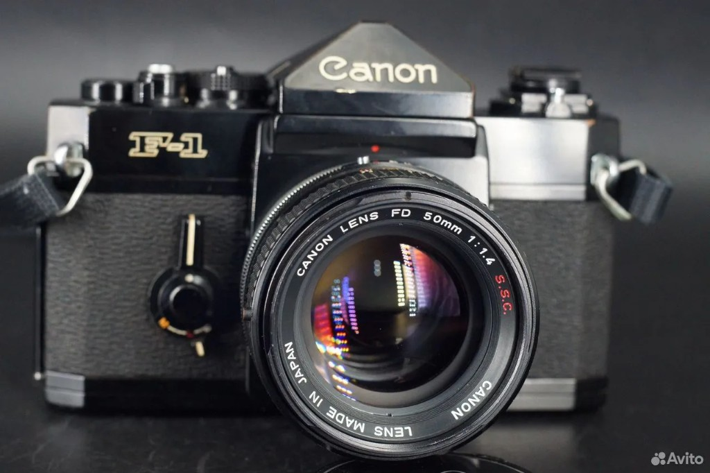
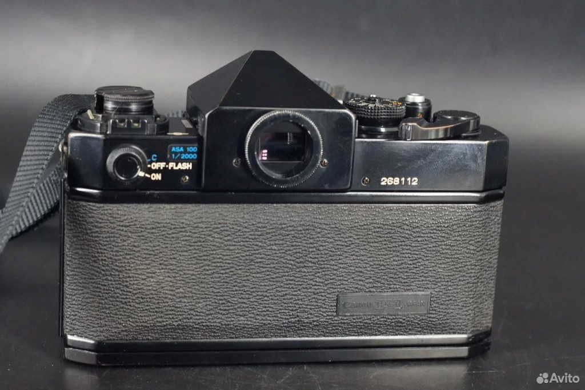
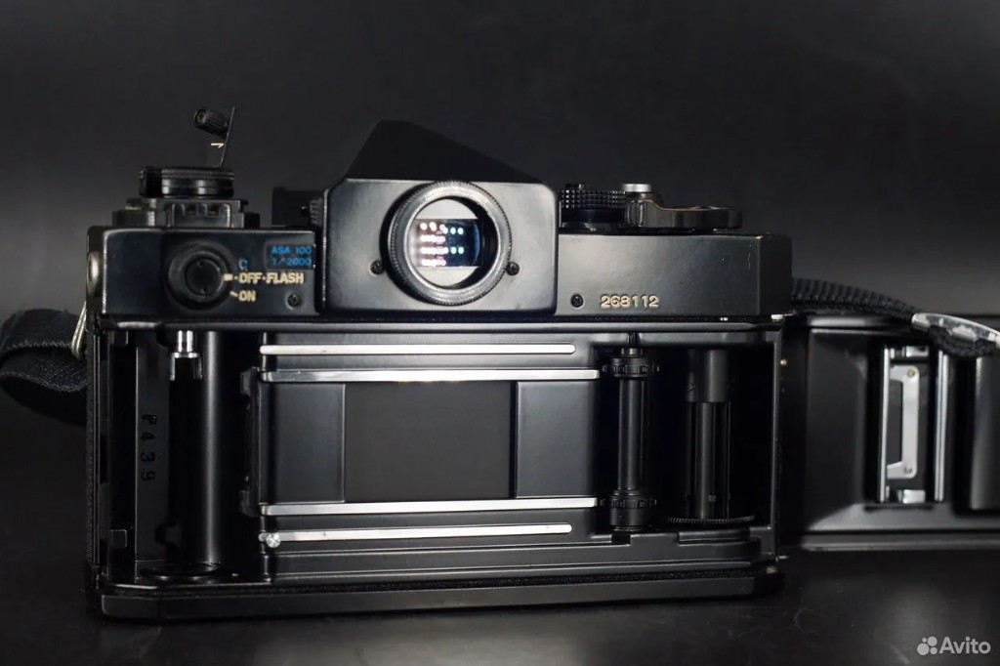
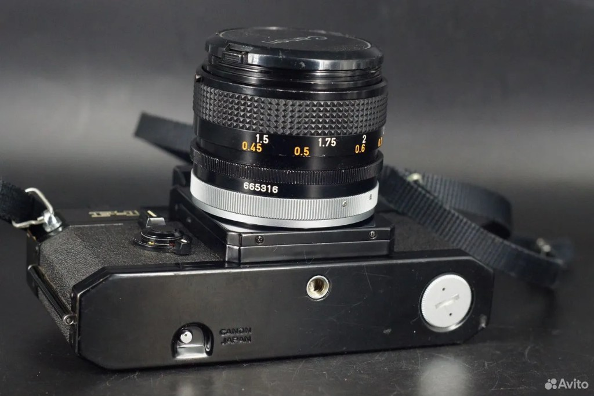

---
tags:
  - фотография
  - выбор-камеры
  - canon-f1
created: 2026-07-08
city: Краснодар
avito: "8030260917"
---

# Canon F-1 + FD 50/1.4 S.S.C. (Avito)

← [[06 - Выбор фотоаппарата. Сводка]] · [[01 - Canon FTb и FL 50-1.4]] · [[05 - Чек-листы]]

| | |
|---|---|
| **Ссылка** | [Avito 8030260917](https://www.avito.ru/moskva/fototehnika/canon_f-1_50_1.4_ssc_8030260917) |
| **Цена в объявлении** | *уточнить* |
| **Справедливо (комплект)** | **20–28 тыс.** |
| **Продавец** | Москва, м. Бабушкинская · Авито Доставка |
| **Статус** | На рассмотрении |

**Описание продавца:** рабочий комплект, чистый объектив, экспонометр ок. Снимков нет. Не бронирует.

---

## Фото из объявления













---

## Что это за аппарат

### Canon F-1

Профессиональный флагман Canon (1971–1981). Полная механика, затвор **1 с — 1/2000**, модульная система. Тяжелее FTb, надёжнее, «танк». Брассинг на фото — боевая патина.

### FD 50mm f/1.4 S.S.C.

Ранний FD (breech-lock). Отличная оптика: контраст, резкость, мало бликов. На F-1 — **открытая диафрагма**, видоискатель яркий. **Без** типичной жёлтизны FL.

| Серийники | |
|-----------|---|
| Body | **268112** |
| Объектив | **665316** |
| Штамп внутри | **P 439** |

---

## Оценка по фото

| Пункт | По фото |
|-------|---------|
| Шторки | 🟢 ровные |
| Камера изнутри | 🟢 чистая |
| Брассинг | 🟡 косметика |
| Светоблоки | 🟡 не видно — спросить |
| Объектив | 🟡 нужен просвет |
| Снимки | 🔴 нет — нужно видео |

---

## Под ваш профиль

| Критерий | F-1 + FD 1.4 |
|----------|--------------|
| Полумрак, боке | ⭐⭐⭐⭐⭐ |
| Ч/б | ⭐⭐⭐⭐⭐ |
| Тёплый винтаж цвета | ⭐⭐ (не жёлтый FL) |
| Винтаж корпуса | ⭐⭐⭐⭐⭐ |
| Бюджет 10–18к | ⭐⭐ |
| Новичку (оптика) | ⭐⭐⭐⭐ проще FD |

---

## Ликвидность и инвестиция

| | |
|---|---|
| Ликвидность | ⭐⭐⭐⭐ (лучше FTb+FL) |
| Инвестиция | ⭐⭐⭐ |
| Перепродажа | ~80–95% при рабочем состоянии |

FD 50/1.4 S.S.C. держит цену лучше жёлтого FL. F-1 — культовый body.

---

## vs FTb + FL

| | F-1 + FD 1.4 | FTb + FL |
|---|--------------|----------|
| Цена | 20–28к | 11–13к |
| Ваш винтаж-цвет | слабее | **сильнее** |
| Оптика | **чище** | мягче, жёлтый |
| Ликвидность | **выше** | средняя |

**Вердикт:** при **≤20к** и живой камере — сильная альтернатива. Если главное — жёлтый FL — оставаться на FTb.

---

## Вопросы продавцу

```
Добрый день! Интересует F-1 с 50/1.4. Планирую взять с доставкой в Краснодар.

Можете перед отправкой:
— видео затвора: 1/2000, 1/250, 1 с
— экспонометр: закрыть объектив → стрелка падает?
— фото открытой крышки — светоблоки целые или крошатся?
— объектив на просвет — есть муть или чисто? диафрагма до f/16 крутится?
— что в комплекте кроме body и объектива? батарейка есть?

Снимков с камеры нет — понял. Видео и просвет для меня важнее.

Авито Доставку в Краснодар отправите? Как упакуете?

Спасибо!
```

---

## Статус

- [ ] Вопросы отправлены
- [ ] Видео получено
- [ ] Решение

---

*← [[06 - Выбор фотоаппарата. Сводка]]*
