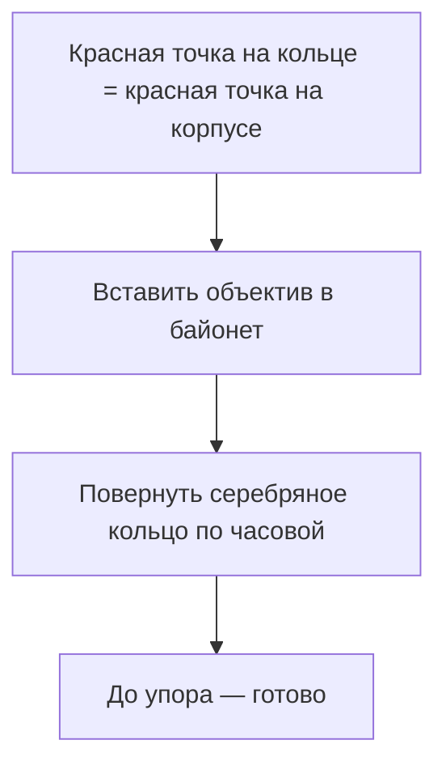
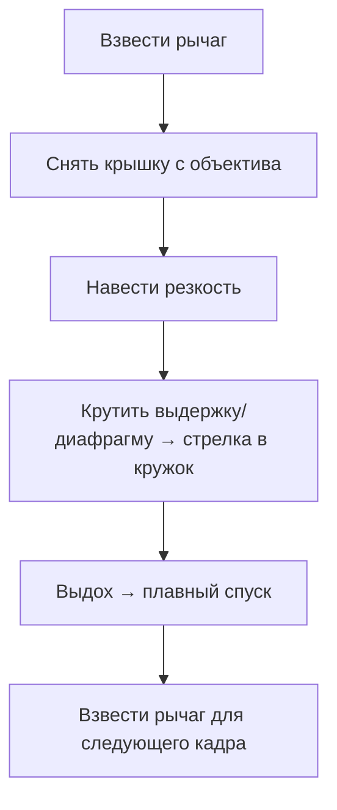

---
tags:
  - фотография
  - canon-f1
  - инструкция
  - новичок
created: 2026-07-10
camera: Canon F-1 + FD 50mm f/1.4 S.S.C.
---

# Canon F-1 — инструкция для новичка

Пошаговое руководство под **ваш** комплект: Canon F-1 + FD 50/1.4 S.S.C.

← [[07 - Canon F-1 + FD 50-1.4 SSC (Avito)]] · [[02 - Экспозиция]] · [[04 - Первые 36 кадров]] · [[05 - Чек-листы]]

---

## Быстрый старт — 5 шагов


1. Вставить **батарейку** (дно корпуса) → переключатель **ON** сзади
2. Проверить, что **объектив** закреплён (серебряное кольцо затянуто)
3. **Загрузить плёнку** (см. ниже)
4. Выставить **ISO** на диске выдержек (= число на коробке плёнки)
5. Сфокусироваться → подкрутить выдержку → **стрелка в кружок** → снять → **взвести**

> [!tip] Главное отличие от FTb
> У вас **FD-объектив** — видоискатель **всегда яркий**, stop-down для экспозиции **не нужен**. Это проще, чем FL на FTb.

---

## Обзор камеры — ваши фото с подписями

### Вид сверху — главные органы управления


| № | Что это | Зачем |
|---|---------|-------|
| 1 | **Кнопка перемотки** (слева, с ручкой) | Отматывает плёнку в катушку в конце рулона |
| 2 | **Пентапризма** (блок с надписью Canon) | Видоискатель. Снимать смотрите сюда |
| 3 | **Диск выдержек** (справа) | Скорость затвора: `1000` … `1` и `B` |
| 4 | **Кнопка спуска** | Снимает кадр (в центре рычага взвода) |
| 5 | **Рычаг взвода** | После каждого кадра — отвести вправо до упора |
| 6 | **Счётчик кадров** | Маленькое окошко у рычага взвода |
| 7 | **Кольцо диафрагмы** на объективе | `1.4` … `16` — насколько открыт «зрачок» |
| 8 | **Кольцо фокуса** | Крутите, пока объект в видоискателе не станет резким |
| 9 | **Серебряное кольцо** у основания объектива | Breech-lock — крепление FD (см. раздел ниже) |

На диске выдержек цифра **60** часто выделена оранжевым — это **синхронизация со вспышкой** (пока вам не нужна).

---

### Спереди — объектив и таймер


| № | Что это | Зачем |
|---|---------|-------|
| 1 | **Объектив FD 50mm f/1.4 S.S.C.** | «Пятидесятка» — универсальный фокус, отличное боке |
| 2 | **Передняя крышка** | Снимайте перед съёмкой, не теряйте |
| 3 | **Рычаг автоспуска** (слева от объектива) | Отведите вниз — затвор сработает через ~10 с |
| 4 | **Логотип F-1** | Ваш body — оригинальный механический F-1 |
| 5 | **Ушки ремешка** | F-1 тяжёлая (~850 г с объективом) — ремешок обязателен |


**Брассинг** (стёртая краска на углах) — это патина от использования, не поломка.

---

### Сзади — экспонометр и ISO


| № | Что это | Зачем |
|---|---------|-------|
| 1 | **Окуляр видоискателя** | Прижимайте глаз плотно, особенно на солнце |
| 2 | **Переключатель ON / OFF-FLASH / C** | `ON` — экспонометр работает; `C` — проверка батарейки |
| 3 | **Окошко ASA / ISO** | Показывает выставленную чувствительность (на фото: 100) |
| 4 | **Серийник body** | **268112** — ваш экземпляр |
| 5 | **Задняя крышка** | Открывается для загрузки плёнки |

---

### Изнутри — куда ложится плёнка


| № | Что это | Зачем |
|---|---------|-------|
| 1 | **Гнездо катушки** (слева) | Сюда вставляется рулон плёнки |
| 2 | **Шторки затвора** (центр) | **Не трогать пальцами!** Только щёлкать спуском |
| 3 | **Зубчики** (вертикальный барабан) | Цепляют перфорацию плёнки |
| 4 | **Барабан намотки** (справа) | Сюда вставляется «язычок» плёнки |
| 5 | **Поролон в пазах крышки** | Светоблоки — если крошатся, будут засветы |
| 6 | **Штамп P 439** | Заводская маркировка (~1975) |

> [!warning] Шторки — хрупкие
> Не открывайте крышку при взведённом затворе. Не щёлкайте затвор без плёнки без необходимости (редкий кадр — ок, серия пустых — лишний износ).

---

### Снизу — батарейка и перемотка


| № | Что это | Зачем |
|---|---------|-------|
| 1 | **Крышка батарейного отсека** | Круглая, откручивается монетой |
| 2 | **Кнопка rewind** (маленькая, в углублении) | Нажать **перед** перемоткой плёнки |
| 3 | **Резьба штатива** | Стандарт 1/4" |
| 4 | **Серийник объектива** | **665316** |

---

## Батарейка

| | |
|---|---|
| **Зачем** | Только для **экспонометра** (стрелка в видоискателе) |
| **Без батарейки** | Затвор, фокус, съёмка — **работают** |
| **Тип** | 1× **PX625** (ртутная, снята) → замена **2× LR44** или адаптер **Wein Cell MRB625** |
| **Где** | Дно корпуса, круглая крышка |
| **Проверка** | Переключатель на `C` — стрелка должна дёрнуться в зону проверки |

> [!tip] LR44 vs Wein
> С обычными LR44 экспонометр может врать на **½–1 ступень**. Сверяйте с приложением **LightMeter** или **Photone** на телефоне.

---

## Объектив — снять и поставить (breech-lock)

Ваш FD 50/1.4 — **breech-lock**: крутится **серебряное кольцо**, а не весь объектив.

### Поставить



1. Найдите **красную точку** на серебряном кольце объектива и на корпусе (над байонетом)
2. Совместите точки, вставьте объектив
3. Поверните **серебряное кольцо** по часовой до лёгкого упора
4. Проверьте: объектив не болтается

### Снять

1. Нажмите **кнопку отцепления** на корпусе (у байонета)
2. Поверните серебряное кольцо **против** часовой
3. Когда точки совпали — выньте объектив
4. Сразу наденьте **заднюю крышку** на body и **переднюю** на объектив

> [!warning] Пыль
> Меняйте объектив **быстро**, в помещении, байонетом вниз. Не дуйте внутрь камеры.

---

## Загрузка плёнки — пошагово

У F-1 **нет QL** (в отличие от FTb) — плёнку наматываете вручную.

### Подготовка

- Делайте **в тени** — не на солнцепёке
- Снимите **переднюю крышку** с объектива (или оставьте — на пустые кадры)

### Шаги

**1. Открыть крышку**

- Нажмите **кнопку-блокиратор** рядом с кнопкой перемотки (сверху слева)
- Потяните **кнопку перемотки вверх** — крышка откроется на пружине

**2. Вставить рулон**

- Катушка **слева**, «хвост» плёнки наматывается **вправо**
- Эмульсия (матовая сторона плёнки) смотрит **к объективу**
- Опустите кнопку перемотки — вилка войдёт в шпиндель катушки

**3. Протянуть плёнку**


- Потяните язычок через **зубчики** к **барабану намотки справа**
- Вставьте конец в **щель** барабана
- Прокрутите **рычаг взвода** — плёнка должна лечь ровно, зубчики цепляют дырочки по краям

**4. Закрыть крышку**

- Если плёнка провисла — крышка не закроется. Подтяните чуть сильнее
- Защёлкните до щелчка

**5. Холостые кадры**

- С крышкой объектива: **2 раза** — взвести → нажать спуск → взвести → спуск
- Счётчик дойдёт до **1** — можно снимать

**6. Проверка**

- Крутите рычаг взвода — **кнопка перемотки должна вращаться** (плёнка реально тянется)
- Если не крутится — откройте и загрузите заново

**7. ISO**

- **Поднимите** наружное кольцо диска выдержек
- Выставьте число с коробки плёнки: **200**, **400** и т.д.
- Окошко сзади покажет выбранный ASA

---

## Экспозиция — три крутилки

Подробная теория → [[02 - Экспозиция]]

| Параметр | Где | Что делает |
|----------|-----|------------|
| **ISO** | Диск выдержек (поднять кольцо) | Зашито в плёнке — выставляете один раз на рулон |
| **Выдержка** | Диск справа сверху | Сколько времени свет попадает на плёнку |
| **Диафрагма** | Кольцо на объективе (`1.4` … `16`) | Сколько света проходит; меньше f = светлее и размытее фон |

### В видоискателе

```
     ↑ пересвет
  ───┼───  стрелка
     ○     кружок ← сюда!
     ↓ недосвет
```

1. Посмотрите в окуляр — видите **расщеплённый круг** с **стрелкой**
2. Крутите **выдержку** или **диафрагму**
3. Стрелка должна встать в **кружок** (или чуть выше для цветной плёнки)
4. Сфокусируйтесь **последним** (на портрете — на глаз ближний к камере)
5. Плавно нажмите **спуск**
6. **Взведите** рычаг

> [!tip] FD = яркий видоискатель
> Вы видите картинку **на открытой** диафрагме. Экспонометр тоже мерит на открытой — удобно. Рычаг предпросмотра ГРИП (слева) нужен только чтобы **увидеть**, как будет размыт фон на f/8, f/11.

### Шпаргалка настроек

| Ситуация | Диафрагма | Выдержка |
|----------|-----------|----------|
| Портрет, боке | **f/1.4 – f/2.8** | 1/125 и короче |
| Улица, солнце | f/8 – f/11 | 1/250 – 1/500 |
| Пасмурно | f/2.8 – f/4 | 1/125 |
| Сумерки с рук | **f/1.4** | 1/30 — осторожно, смаз |
| Пейзаж, всё резко | f/8 – f/11 | по стрелке |

**Правило:** с рук выдержка не длиннее **1/60** (для 50mm). Лучше **1/125**.

---

## Один кадр — полный цикл



1. **Взвести** (если ещё не взведён)
2. Снять **крышку**
3. **Сфокусироваться**
4. **Экспозиция** — стрелка в кружок
5. **Снять**
6. **Взвести** снова

Счётчик показывает, сколько кадров осталось (36 → 1).

---

## Конец рулона — перемотка

1. Когда плёнка кончилась — рычаг взвода **не взводится** (упрётся)
2. **Не открывайте** крышку!
3. Переверните камеру
4. Нажмите **кнопку rewind** на дне (утопленная)
5. Разверните **ручку перемотки** на крышке и крутите **по часовой**
6. Крутите, пока не станет **легко** (плёнка вошла в катушку)
7. Откройте крышку **в тени**
8. Выньте катушку, **загните язычок** плёнки
9. Положите в **коробочку**, отнесите в лабу → [[03 - Плёнка и лаборатория]]

---

## Первый рулон — учебный план

Полный план → [[04 - Первые 36 кадров]]

| Кадры | Что снимать | Настройки |
|-------|-------------|-----------|
| 1–6 | Комната, окно, стол | f/8, выдержка по стрелке |
| 7–12 | Портрет / отражение | **f/1.4**, 1/125, фон далеко |
| 13–18 | Улица, двор | f/8, 1/250 |
| 19–24 | Тот же кадр на **f/4** | Сравнить размытие фона |
| 25–30 | Сумерки у окна | f/1.4, самая короткая выдержка без смаза |
| 31–36 | Всё, что нравится | Эксперимент |

**Записывайте в телефон:** № кадра → сюжет → f → выдержка. Когда придут сканы — поймёте закономерности.

---

## Частые ошибки новичка

| Ошибка | Что будет | Как избежать |
|--------|-----------|--------------|
| Забыли **взвести** | Пустой кадр / кадр не снялся | После каждого кадра — рычаг вправо |
| Сняли с **крышкой** на объективе | Чёрный кадр | Привычка: крышка в карман |
| Долгая выдержка с рук | Смаз | Не длиннее 1/60, лучше 1/125 |
| Открыли крышку на солнце | Засвет хвоста плёнки | Только в тени |
| Не выставили **ISO** | Экспонометр врёт | Проверить окошко ASA сзади |
| Трогали **шторки** пальцами | Поломка | Только спуском |
| Крутят **весь объектив** при снятии | Заедание, поломка | Крутить **серебряное кольцо** |
| Плёнка не натянута | Засветы, пустые кадры | Перемотка крутится? Если нет — перезагрузка |

---

## Осмотр в ПВЗ (когда приедет)

Чек-лист → [[07 - Canon F-1 + FD 50-1.4 SSC (Avito)#Осмотр при получении (ПВЗ)]]

Кратко: затвор на всех выдержках → экспонометр → просвет объектива → светоблоки → подушка зеркала.

---

## Полезные ссылки

| Тема | Куда |
|------|------|
| Ваша камера, серийники | [[07 - Canon F-1 + FD 50-1.4 SSC (Avito)]] |
| Экспозиция подробно | [[02 - Экспозиция]] |
| Какие плёнки, лаба Краснодар | [[03 - Плёнка и лаборатория]] |
| Чек-листы | [[05 - Чек-листы]] |
| Официальный мануал (EN) | [Canon F-1 Manual — ManualsLib](https://www.manualslib.com/manual/457652/Canon-F-1.html) |

---

## Словарик

| Термин | Простыми словами |
|--------|------------------|
| **Затвор** | Шторки, открывающиеся на выдержку |
| **Взвод** | Подготовка затвора к следующему кадру |
| **Диафрагма (f/)** | «Зрачок» объектива; f/1.4 — максимально открыт |
| **Боке** | Размытие фона |
| **ГРИП** | Глубина резко прорисованного пространства |
| **Breech-lock** | Крепление FD: крутится кольцо у основания |
| **ASA / ISO** | Чувствительность плёнки |
| **C-41** | Проявка цветной плёнки (стандарт) |
| **Светоблоки** | Поролон в пазах — не пускает посторонний свет |
| **Брассинг** | Стертая краска на углах — косметика |

---

*Удачного первого рулона. Вопросы — в чат или дополняйте эту заметку своими наблюдениями.*

*← [[00 - Плёнка. Главная]] · [[07 - Canon F-1 + FD 50-1.4 SSC (Avito)]]*
