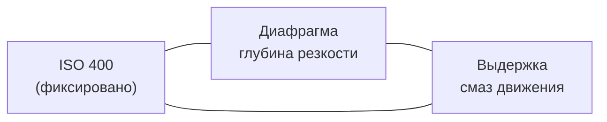

---
tags:
  - фотография
  - плёнка
  - canon-f1
  - cheat-sheet
aliases:
  - F-1 экспозиция
  - Pan 400 настройки
created: 2026-07-10
camera: Canon F-1
lens: "50mm f/1.4"
films:
  - Fujicolor C200
  - Kodak Gold 200
  - Ilford Pan 400
---

# Canon F-1 + 50/1.4 — плёнка и экспозиция

> [!info] Связка
> **Камера:** Canon F-1 · **Объектив:** 50mm f/1.4  
> **Первый набор плёнки:** Color 200 (C200 / Gold 200) + **Ilford Pan 400**

---

## Плёнка: что купить первым

| Рулон | Когда | Зачем |
|-------|-------|-------|
| **Fuji C200** или **Kodak Gold 200** | Яркий день, улица | Цвет, прощает ошибки |
| **Ilford Pan 400** | Вечер, тень, интерьер, ч/б | ISO 400 + f/1.4 |

**Порядок съёмки:** сначала цветной дневной рулон → потом Pan 400.

| Плёнка | Характер |
|--------|----------|
| Fuji C200 | Холоднее, зеленее |
| Kodak Gold 200 | Теплее, мягче на коже |

---

## Экспозиционный треугольник



> [!warning] Главное
> **Диафрагма и выдержка не меняют контраст напрямую** — они задают **количество света** (экспозицию).  
> Контраст — это **свет в кадре**, **проявка**, **фильтры**, **печать/скан**.

### Что делает каждый параметр

| Параметр | Влияет на | Не влияет на |
|----------|-----------|--------------|
| **Диафрагма** | Свет, глубина резкости, отделение фона | Химический контраст плёнки |
| **Выдержка** | Свет, смаз движения | Контраст (кроме очень длинных выдержек) |
| **ISO** | Чувствительность плёнки | — |

### Косвенное влияние экспозиции на «контраст»

| Экспозиция | Эффект на Pan 400 |
|------------|-------------------|
| **Норма** | Ровные тени и света |
| **Недоэкспозиция (−1 и больше)** | Тени в чёрный → кажется контрастнее, но детали теряются |
| **Переэкспозиция (+1)** | Мягче, больше деталей в тенях |

> [!tip] Практика
> Снимайте **в норму** или **−0,3 стопа**. Не недоэкспонируйте «для контраста».

### Диафрагма и «ощущение» контраста

| Диафрагма | Эффект |
|-----------|--------|
| **f/1.4 – f/2.8** | Размытый фон → субъект «выпрыгивает» |
| **f/5.6 – f/11** | Всё резко → ровнее, классическая улица |

---

## Общие правила для Canon F-1

- [ ] Батарейка замера исправна (без неё экспозиция неверна)
- [ ] ISO в камере = **400** для Pan 400
- [ ] Замерять **по главному объекту** (лицо, фигура), не по окну/небу
- [ ] Держать камеру устойчиво от **1/60** и длиннее
- [ ] Проявка: цвет → **C-41**, Pan 400 → **ч/б** (не смешивать)

---

## Сценарий 1: Портрет у окна

> [!example] Условия
> Боковой свет из окна · расстояние 1–1,5 м · Pan 400

### Настройки

| Параметр | Значение |
|----------|----------|
| ISO | **400** |
| Диафрагма | **f/1.4 – f/2.8** (старт: **f/2**) |
| Выдержка | **1/60 – 1/250** (по замеру) |
| Фокус | **Ближний глаз** |

### Таблица выдержек (нормальная экспозиция)

| Диафрагма | Выдержка |
|-----------|----------|
| f/1.4 | 1/125 – 1/250 |
| f/2 | 1/60 – 1/125 |
| f/2.8 | 1/30 – 1/60 |

### Пошагово

1. Человек **боком к окну** (свет сбоку, не в лоб)
2. Камера на **1–1,5 м**, кадр по пояс или крупнее
3. Диафрагма **f/2**
4. Фокус на **ближний глаз**
5. Замер **по лицу**
6. Если яркое окно в кадре — **+0,3…+0,5 стопа** к выдержке

### Контраст без хитростей

- Одна половина лица в свету, другая в тени
- f/1.4–f/2 отделяет от фона

---

## Сценарий 2: Улица, солнечный день

> [!example] Условия
> Яркое солнце · короткие тени · Pan 400

### Правило «Солнечное 16» (ISO 400)

```
f/16  →  1/400
f/11  →  1/800
f/8   →  1/1000
f/5.6 →  1/2000
```

> [!note] Лимит F-1
> Макс. выдержка часто **1/1000** → на f/8 берите **1/1000** (чуть светлее, для улицы нормально).

### Стартовые настройки

| Параметр | Значение |
|----------|----------|
| ISO | **400** |
| Диафрагма | **f/5.6 – f/8** |
| Выдержка | **1/500 – 1/1000** |

### Пошагово

1. **f/8**, выдержка **1/500** — проверить замер
2. Фокус: на человека или **3–5 м** (улица вглубь)
3. В тени (под навесом): открыть на 1–2 стопа → **f/5.6 + 1/125** или **f/4 + 1/250**

### Варианты по сюжету

| Сюжет | Диафрагма | Выдержка (солнце) |
|-------|-----------|-------------------|
| Портрет на улице | f/2.8 | 1/1000 – 1/2000 |
| Два человека | f/4 | 1/1000 |
| Улица, здания | f/8 – f/11 | 1/500 – 1/1000 |
| Силуэт | Замер по небу | Объект в тени |

---

## Шпаргалка (копировать в заметку дня)

```
┌─────────────────────────────────────────────────────────┐
│  ПОРТРЕТ У ОКНА          │  УЛИЦА, СОЛНЦЕ              │
├───────────────────────────┼──────────────────────────────┤
│  ISO 400                  │  ISO 400                     │
│  f/1.4 – f/2.8  (старт f/2)│  f/5.6 – f/8                │
│  1/60 – 1/250             │  1/500 – 1/1000              │
│  Фокус: ближний глаз      │  Фокус: человек / 3–5 м      │
│  Свет сбоку               │  Тени = контраст             │
└─────────────────────────────────────────────────────────┘
```

---

## Проявка Pan 400

| Цель | Проявитель | Примечание |
|------|------------|------------|
| **Контрастнее** | Rodinal **1:50**, 20 °C, ~13–15 мин | Спросить в лаборатории |
| **Мягче** | D-76 / ID-11 **1:1**, ~11–13 мин | Портреты, ровные тона |

Фраза для лаборатории: *«Pan 400, обычная контрастная проявка»*.

---

## Частые ошибки

| Ошибка | Результат |
|--------|-----------|
| Замер по окну за спиной | Лицо в глубокой тени |
| f/1.4, промах по фокусу | Размытые глаза |
| 1/30 на улице без стабилизации | Смаз |
| Сильное недоэкспонирование | Чёрные дыры вместо теней |

---

## Color 200 — быстрый ориентир (дневной рулон)

| Условия | Диафрагма | Выдержка (ISO 200) |
|---------|-----------|---------------------|
| Солнце | f/8 – f/11 | 1/250 – 1/500 |
| Облачно | f/5.6 | 1/125 – 1/250 |
| Портрет, открыто | f/2.8 – f/4 | 1/250 – 1/500 |

> [!tip] Первый рулон
> Снимайте **днём на улице** — проще попасть в экспозицию, чем на Pan 400 вечером.

---

## Связанные заметки

- [[Ч/б контраст — диафрагма vs выдержка]]
- [[Ilford Pan 400]]
- [[Fujicolor C200 vs Kodak Gold 200]]

---

## Чеклист перед выходом

- [ ] Батарейка замера
- [ ] Плёнка загружена, ISO выставлен
- [ ] Рулон C200 — днём / Pan 400 — вечером
- [ ] Помню: замер по объекту, не по фону
